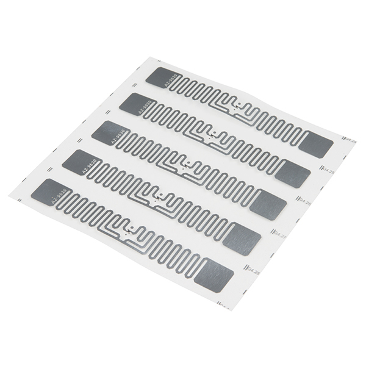
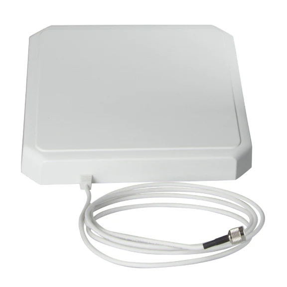
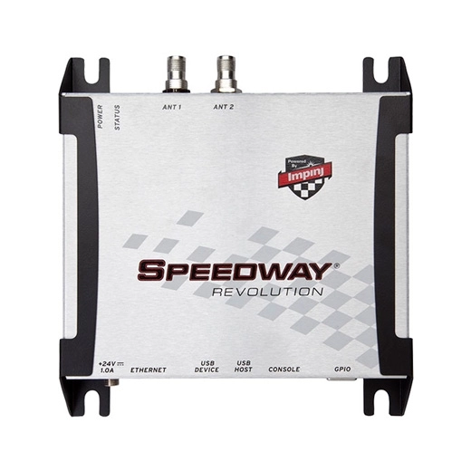
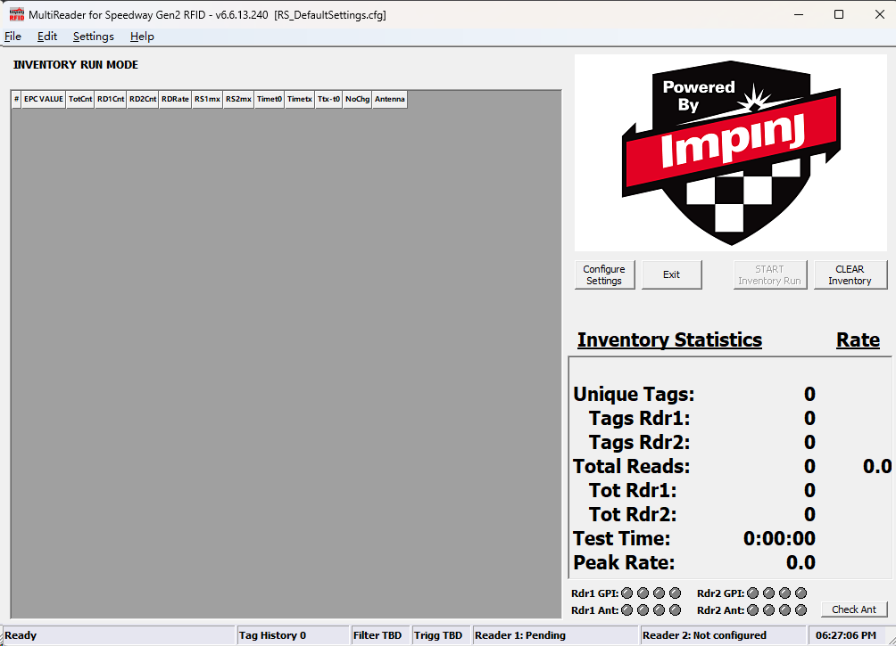
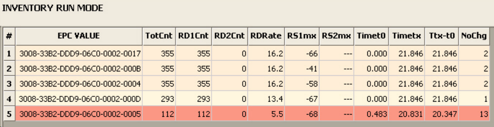
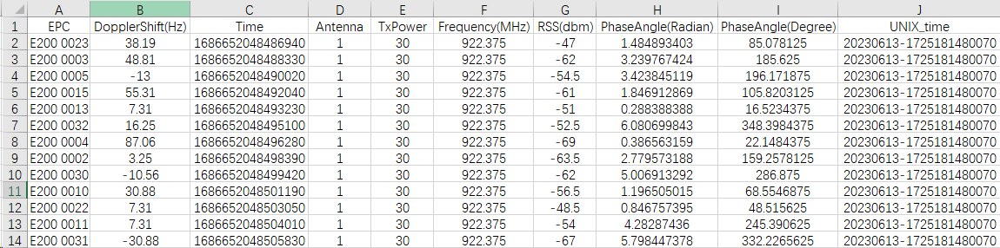
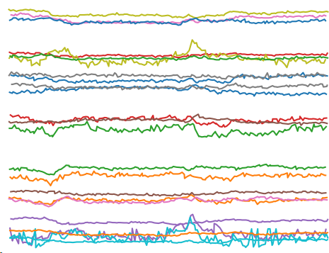

# RFID Hardware Tutorial

## Hardware preparation

- Impinj Speedway R420 RFID Reader
- UHF RFID Tag
- RFMax S9028PCLJ RFID Antenna

## Setup MultiReader for Speedway RFID

You can install the software by referring to the documentation on the official website.

https://www.impinj.com/products/readers/impinj-speedway

 [lmping_R420_安裝手冊.pdf](F:\迅雷下载\lmping_R420_安裝手冊.pdf) 

We also provide software installation packages: [Impinj_MultiReader_6_6_13.zip](..\..\RFID\Impinj_MultiReader_6_6_13.zip) 

If the installation and configuration are successful, the software can read the tag value correctly after connecting the RFID Reader, as shown in the figure below.

## Configure the collection environment

Before proceeding to this step, please make sure that the above software is properly installed and that the RFID Reader is successfully connected and the corresponding Tag has available.

 [TagGesture.zip](..\..\RFID\TagGesture.zip) , this project is able to save the Tag value read by the RFID Reader as a CSV file, the specific content of the saved data is shown in the following figure.

In our project, we use 23 Tag, 30hz, to extract PhaseAngle (Radian) data for subsequent tasks

## Visualize RFID data

You can execute this script  [read_rfid.py](..\..\PycharmProjects\deep-learning-for-image-processing-master\pytorch_classification\github\XRF_dataset\read_rfid.py)  to visualize the RFID data you have collected, the visualization result is shown below.

