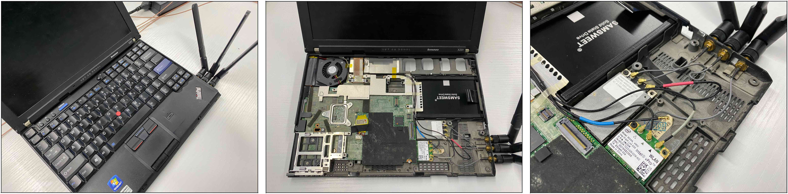

# Wi-Fi Hardware Tutorial

## Hardware preparation

- Recommended computer equipment: ThinkPad X201
- Be sure to use an Intel 5300 NIC.



## Setup Linux 802.11n CSI Tool

Reference Links:https://dhalperi.github.io/linux-80211n-csitool/

## Customize data collection

Before proceeding, please make sure that the CSI tool has been installed successfully and is running smoothly during the demonstration demo.

### Change of transmit frequency

linux-80211n-csitool-supplementary/injection/random_packets in the csi-tool project.

In our project use :

```bash
linux-80211n-csitool-supplementary/injection/random_packets 1000000000 100 1 5000
```

where the first parameter is the cumulative number of packets sent, the second parameter is the size of the packet, the third parameter 1 represents the injection MAC, and the last parameter represents the packets sent every 5,000 microseconds, i.e., 200 packets a second (frequency).

### Customize the number of transmitter antennas

In our project use :

```bash
sudo echo 0x4101 | sudo tee /sys/kernel/debug/ieee80211/phy0/iwlwifi/iwldvm/debug/monitor_tx_rate
```

The last three binary digits control the number of transmitter antennas, if Bits[14,15,16]=[1,1,1] means all three transmitter antennas are used, in our project Bits[14,15,16]=[0,1,0] means only one transmitter antenna is used.

### Customize collection time

Since the native code can only keep collecting packets, we provide a code that can collect packets and stop them automatically after n seconds (code/log_to_file_time.c).

Usage is as follows:

```bash
sudo linux-80211n-csitool-supplementary/netlink/log_to_file dat_name 5
```

where the first parameter is the name of the data and the second parameter is the collection time in seconds.

### Add timestamp

We also provide a way to log timestamps to a txt file while collecting counts, again in code/log_to_file_time.c.

Use as shown in the previous section.

## CSI Data Processing

To parse the data we have to use a read_bf_file file in CSI TOOL, just copy the folder linux-80211n-csitool-supplementary/matlab.

The matlab parsing script is as follows(code/read_dat.m), this m-file needs to be stored in the same folder as the read_bf_file file and needs to be added to the path when running.

```matlab
clc;
clear;
csi_trace = read_bf_file('name.dat');
len = length(csi_trace)
ant_csi = zeros(30,len,3);
for j=1:3
  for i=1:len
    if(isempty(csi_trace{i}))
        break;
    end
    csi_entry = csi_trace{i};
    csi = get_scaled_csi(csi_entry);
    csi =csi(1,:,:);
    csi1=abs(squeeze(csi).');
    ant_csi(:,i,j)=csi1(:,j);  
  end 
  subplot(3,1,j);
  plot(ant_csi(:,:,j).');
  hold on
end
% To save the csi as a .csv file, uncomment the following two lines
% dstDir = strcat(path_to_save,'.csv')
% writematrix(ant_csi,dstDir);
size(ant_csi);
```

The following images visualize the CSI data received by one of our RX devices from volunteers performing the "carrying weight" action.


