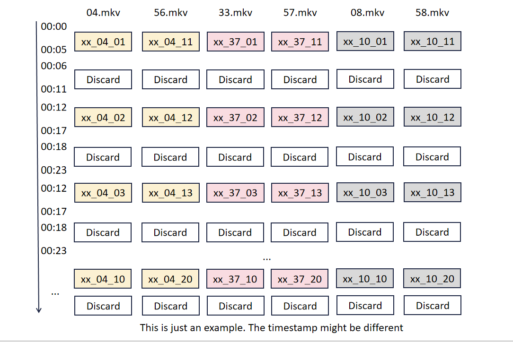

# Main Tutorial

We have listed tutorials for all the hardware used in our project, including WiFi, RFID, mmWave and Kinect, which you can deploy on your own platform with the tutorials!

We used one PC for RFID and Kinect acquisition, and one other  PC for mmWave acquisition.

Time synchronization between two pc devices and four WiFi devices (1TX, 3RX) via ntp to synchronize acquisition.

## Hardware Setup

[WiFi Tutorial](https://github.com/aiotgroup/XRF55-repo/tree/main/hardware%20tutorial/WiFi)

[RFID Tutorial](https://github.com/aiotgroup/XRF55-repo/tree/main/hardware%20tutorial/RFID)

[mmWave Tutorial](https://github.com/aiotgroup/XRF55-repo/tree/main/hardware%20tutorial/mmWave)

[Kinect Tutorial](https://github.com/aiotgroup/XRF55-repo/tree/main/hardware%20tutorial/Kinect)

## PC1(RFID+Kinect)

-  [TagGesture.exe](./assets/pc1/TagGesture.exe) This file is the RFID file is compiled and generated by the executable file, but we suggest that you can modify the file in the RFID project to regenerate, because **our project set the action time is 5 seconds, repeat 20 times, may not be suitable for your project!**
-  [soundbee.py](./assets/pc1/soundbee.py) This file is simply used for the script that we use to give the volunteers the sound signals for the beginning and end of the acquisition, and again it will be repeated 20 times.
-  [azure_kinect_recorder.py](./assets/pc1/azure_kinect_recorder.py) The specific use of this file can be found in the Kinect Tutorial for controlling the opening and closing of the Kinect device.
-  [config.txt](./assets/pc1/config.txt) This file is used for parameter configuration, where the first line is the volunteer number, the second line is the action number, the third line can be ignored, the fourth line is the acquisition start time, and the fifth line is the action index.
-  [run.py](./assets/pc1/run.py) This file is the collection of pc1 entry script, the script is used to control the operation of all other scripts, if you want to use the script is recommended to modify according to your project

## PC2(mmWave)
Two files that you need to run in sequence:
- [loopdatacollection.m](./assets/pc2/loopdatacollection.m) This file is the main file for mmwave data collection. It reads parameters from params.txt. Remember to set the base folder for saving data.

- [run.py](./assets/pc2/run.py) This file is simliar to the run.py file in PC1. 

Other files: 
- [params.txt](./assets/pc2/params.txt)  Same as config.txt in PC1. This file is used for parameter configuration, where the first line is the volunteer number, the second line is the action number, the third line is used to determine whether the action is 5s or not, the fourth line is the acquisition start time, and the fifth line is the action index.

- [mydatacollection.m](./assets/pc2/mydatacollection.m) This file includes a function which can send commands to mmwave studio to let it start collecting data. Remember to set the path of RtttNetClientAPI.dll. 

- [Init_RSTD_Connection.m](./assets/pc2/Init_RSTD_Connection.m) This script establishes the connection between mmWaveStudio software and Matlab software.

## Notes:
For time saving purpose, there are some actions which are not collected according to action class. 

RFID, WiFi, mmWave have already been rearranged. However, the Kinect files are not segmented and have not been rearranged. Here are the tips.

Type 1: Actions that are collected in pairs.

Type 2: Actions that need time to reset.
